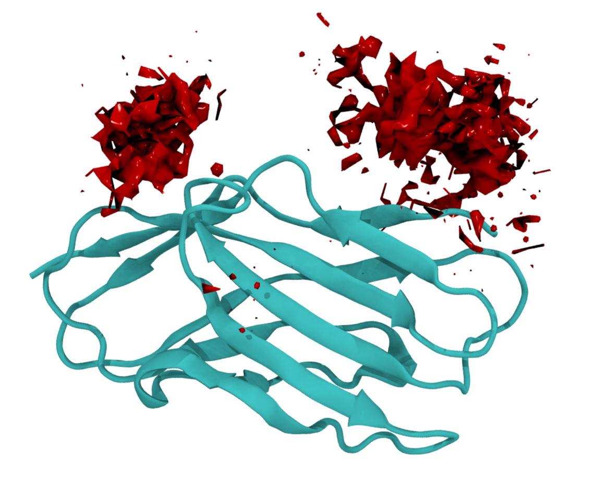

# Volumetric Density Maps from MD Trajectories

Compute 3D density maps (percent occupancy) of selected atoms/molecules from molecular dynamics trajectories.
Aligns to a reference selection, bins atoms onto a regular grid, and exports OpenDX (.dx) for visualization (e.g., VMD), plus an aligned GROMACS .gro frame for overlays.

Example density map from the (very short) example trajectory in example/ :



# How to use
Requires MDAnalysis, tqdm and numpy

```python
# Example usage:
# Load your trajectory an create the object
u = md.Universe('example/topol.gro', 'example/traj.xtc')
density_estimator = Density3D(u)

# Calculate and save the density
# center_sel: selection for alignment (e.g., protein CA atoms)
# ligand_sel: selection for density calculation (e.g., all non-protein atoms)
# grid_size: size of the grid cells in Å - smaller, finer grid, more resolution, but slower
# dx_out: output .dx file for density
# gro_out: output .gro file for an aligned frame to overlay the density

density_estimator.calculate_and_save_density(
    center_sel='protein and name CA',
    ligand_sel='not protein',
    grid_size=1,
    dx_out='example/density.dx',
    gro_out='example/aligned_frame.gro'
)
```

